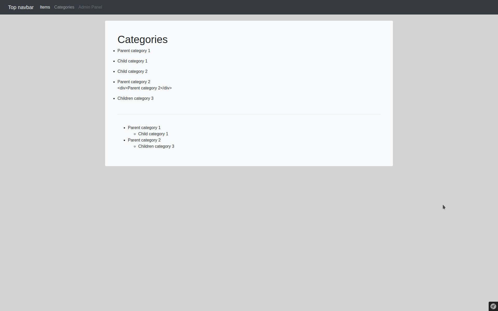

## Installation

### Clone repository and run docker
1. git clone https://github.com/varahi/symfony_test.git
2. cd directory "symfony_test/docker" and run ./docker-compose.sh
Phpmyadmin http://127.0.0.1:8765/ login: root pass: dev

### Build project
1. cd directory "src" and run composer update
2. yarn install
3. yarn add bootstrap --dev
4. npm install bootstrap --save-dev
5. yarn add vue@^2.5 vue-loader@^15.9.5 vue-template-compiler --dev
6. yarn add axios --dev
7. yarn build

### Import database
cat database.sql | docker exec -i test_project_mysql /usr/bin/mysql -u root --password=dev symfony_dev

## Описание проекта
1. В качестве CRUD для катеогрий использульзется бандл "EasyAdmin". Создано два CRUD контроллера ItemCrudController и CategoryCrudController. 
Дочерние категории имеют связь "один-ко-многим". Товары имеют связь с категориями как "многие-ко-многим"
2. Создано два стандартных контроллера ItemController и CategoryController, которые отображают twig шаблоны и генерируют JSON для Vue.js
JSON доступны по следующим ссылкам:
http://127.0.0.1/api/items 
http://127.0.0.1/api/categories

В папке src/assets/js/components доступны следующие Vue.js компоннеты Items.vue и Categories.vue которые занимаются HTML рендерингом.
Поскольку я познакомился с Vue.js только при выполнении данной задачи, то я не стал делать вывод категорий с учетом родительских и дочерних.
В качестве примера, я сделал такой вывод используя стандартный twig, файл src/templates/category/index.html.twig

